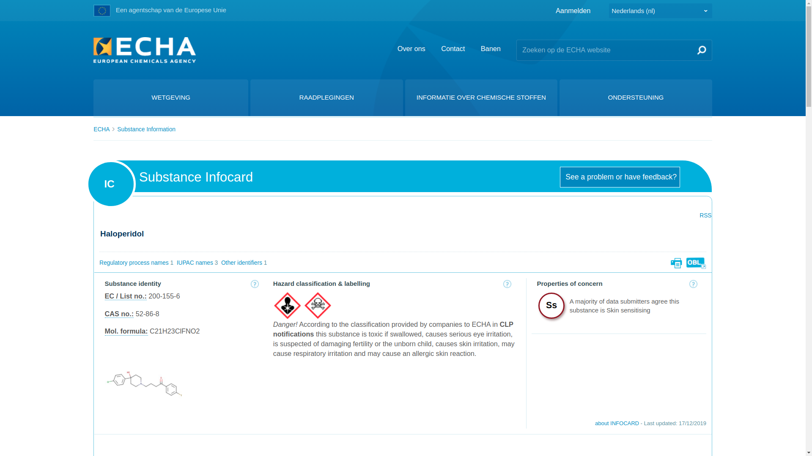
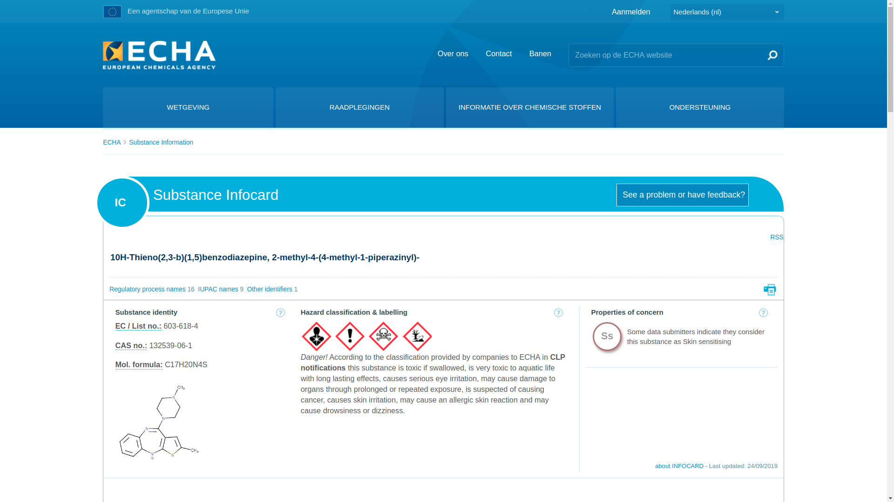
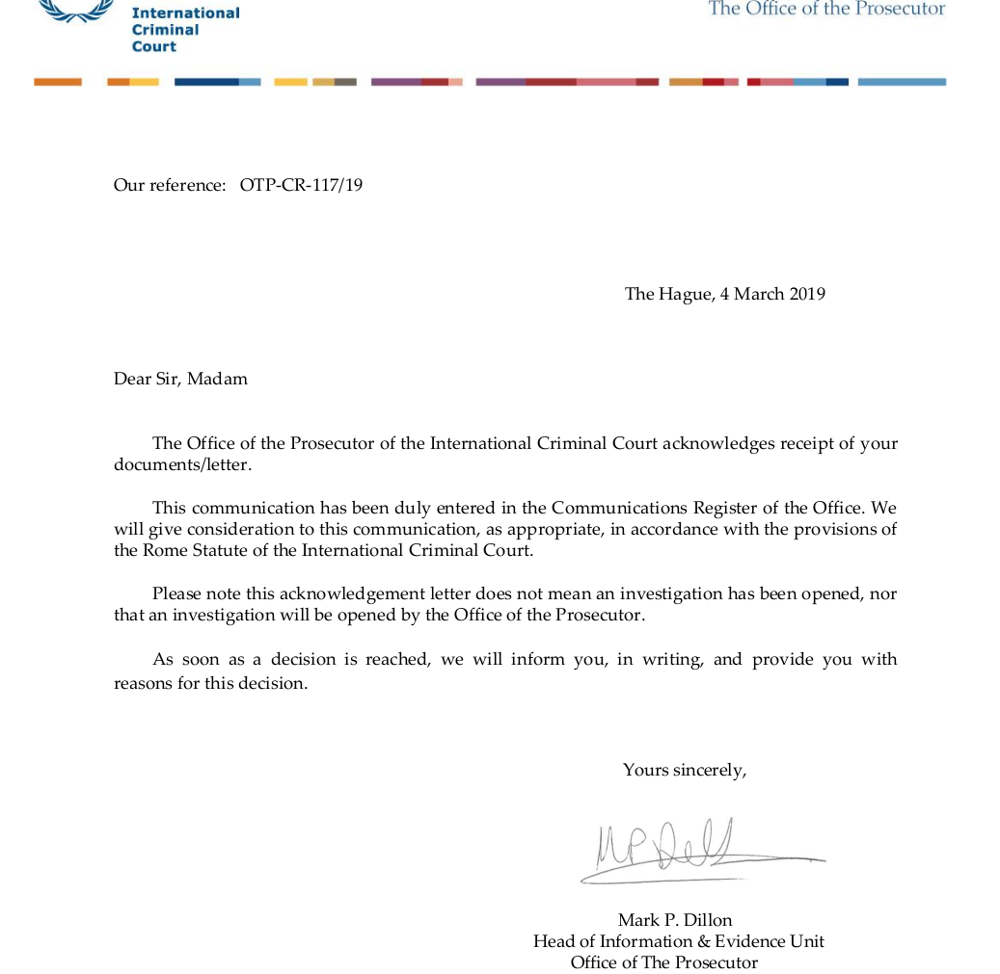

.. _home:

.. title:: OTP-CR-117/19

.. raw:: html

      
    

    <b>
    
Office of the Prosecutor Communication Record 117 of 2019

.. raw:: html

    </b>
    

     

| **Information and Evidence Unit**
| **Office of the Prosecutor**
| **Post Office Box 19519**
| **2500 CM The Hague**
| **The Netherlands** 
|

Hello Office of the Prosecutor, 

i write you in the context of communications and claims under art.15 of 
the Rome Statute. i want to inform the prosecutor that the king of the 
netherlands and his government are commiting 3 of the 5 crimes defined 
in the Rome Statute. 

The dutch government has introduced three new forced care laws, the Wfz 
(wet forensische zorg) for criminals, the WvGGZ (Wet verplichte GGZ) for 
the disturbed and addicted and the Wzd (Wet zorg en dwang) for the 
handicapped.

Both the chamber suggesting these laws to the king and the king himself 
have been informed about the fact the the substances administered under 
these laws are proven to be poison.
 
There is proof the medication used in forced treatements in the 
netherlands are poison, see copies of the ECHA <`European Chemical Agency`>
website for:

(1) :ref:`haldol <haldol>`
(2) :ref:`clozapine <clozapine>`
(3) :ref:`zyprexa <zyprexa>`
(4) :ref:`abilify <abilify>`

With the mass scale torture with poison the king of the netherlands and 
his chamber:

(1) kills
(2) does grave bodily and mental harm
(3) makes impotent

on the following victim groups here in the Netherlands:

(1) verslaafden (addicts)
(2) bejaarden (elderly)
(3) ggz patienten (psychiatric patients)
(4) criminelen (criminials)
(5) gehandicapten (handicapped)

Since the members of the :ref:`chamber <chamber>` and the :ref:`king <king>`
were aware that these medicine are poison at the time they voted for this law
and the day the Wfz law took effect (1-1-2019), i ask the prosecutor to
prosecute the king for making the commiting of the above mentioned crimes
(killing, torture and impotent making) possible.

p.s.

1) Entered in the Communications Register of the Office on :ref:`4 march 2019 <writings>`
2) Your reference ``OTP-CR-117/19``

.. raw:: html

     
    

    <b>

R E C O N S I D E R

.. raw:: html

    </b>
    

     

.. _request:

|
| **Information and Evidence Unit**
| **Office of the Prosecutor**
| **Post Office Box 19519**
| **2500 CM The Hague**
| **The Netherlands**
|

Dear Mister Mark P. Dillon,

i received your writing to not to proceed with my request ``OTP-CR-117/19`` on 20-05-2019.

i write you to ask you to reconsider now removed evidence has been restored online again.

In chronological order:

11-12-2017 I informed the chamber of the fact that the medicine used in treatements of psychiatric illnesses are poison. The proof exists of a url to the European Chemical Agency, showing that Haldol is a toxic substance (toxic if swallowed accompanied by a skull en bones). This link worked a the time the chamber member were informed.

23-01-2018 The Chamber votes in favour of the Wet Forensische Zorg, Wet verplichte GGZ, Wet Zorg en Dwang knowing that the medicine used in these treatements are poison.

05-10-2018 I inform the King of the fact that these medicine are poison

01-01-2019 The Wet Forensische Zorg is activated

10-01-2019 I inform local authorities of the informednes of both the chamber member and the king.

21-01-2019 I inform the Office of the Prosecutor with proof that these medicine are poison and proof of the informedness of the King and the chamber members.

23-01-2019 I withdraw the request to arrest king and chamber member from the local authorities. They didn't react at all.

06-02-2019 The information on the ECHA website about Haldol being a poison is removed and a "nothing wrong with it" version is added

25-02-2019 After consideration i decided to formaly ask the king and chamber members to be prosecuted.

27-02-2019 I noticed that the site was updated and informed the Office of the Prosecutor about it.

20-05-2019 The Prosecutor informs me of his decision to not to proceed, mentioning the he could reconsider if new evidence arises.

25-06-2019 I talk to members of ECHA on twitter and got the link to the proof restored.

Knowing that the proof that Haldol is a poison was offline when you reached your conclusion to not to proceed, could you reconsider your conclusion now this proof is back online again ?

.. _guilty:

.. raw:: html

     
    

    <b>

Q U I L T Y

.. raw:: html

    </b>
    

     

.. _informed:

**INFORMED**

.. raw:: html

     

.. image:: informed.jpg
    :width: 100%

.. raw:: html

     

.. _chamber:

**CHAMBER**

.. raw:: html

     

.. image:: kamer2.png
    :width: 100%

.. raw:: html

     

.. _king:

**KING**

.. raw:: html

     

.. image:: bevestigd.jpg
    :width: 100%

.. _evidence:

.. raw:: html

      
    

    <b>

E V I D E N C E

.. raw:: html

    </b>
    

     

.. _haldol:

**HALDOL**

.. raw:: html

   

.. raw:: html

   

.. _clozapine:

**CLOZAPINE**

.. raw:: html

   

.. image:: ECHAclozapine.png
    :width: 100%

.. raw:: html

    

.. _zyprexa:

**ZYPREXA**

.. raw:: html

   

.. raw:: html

   

.. _abilify:

**ABILIFY**

.. raw:: html

   

.. image:: ECHAabilify.png
     :width: 100%

.. _writings:

.. raw:: html

     
    

    <b>

W R I T I N G S

.. raw:: html

    </b>
    

     

**EMAIL 1**

|
| **From**: Bart Thate <bthate@dds.nl>
| **To**: otp.informationdesk@icc-cpi.int
| **Subject**: Information that the king of the netherlands is aware that the medicine administered with the use of new defines laws are proven to be poison and is commiting 3 of 5 genocide crimes on parts of the population here in the netherlands
| **Message-ID**: <e49d02a2-6a8e-ad64-6c8d-9abd45cf5c0e@dds.nl>
| **Date**: Mon, 21 Jan 2019 16:17:13 +0100
|

see :ref:`reconsider <home>` for content.

.. raw:: html

     

**ACK**

.. raw:: html

     

.. raw:: html

     

**OTP-CR-117/19**

.. raw:: html

     

.. image:: OTP111.png
    :width: 100%

.. raw:: html

     

**EMAIL 2**

|
| **From:** Bart Thate <bthate@dds.nl>
| **To:** OTP InformationDesk <OTP.InformationDesk@icc-cpi.int>
| **Subject:** Request to reconsider OTP-CR-117/19
| **Message-ID:** <33777b52-6be9-72b2-f756-d5482d32f03d@dds.nl>
| **Date:** Wed, 26 Jun 2019 21:05:13 +0200
|

see :ref:`request <request>` for content.

.. raw:: html

     

**OTP-CR-117/19/001**

.. raw:: html

     

.. image:: OTP222.png
    :width: 100%

.. raw:: html

     
